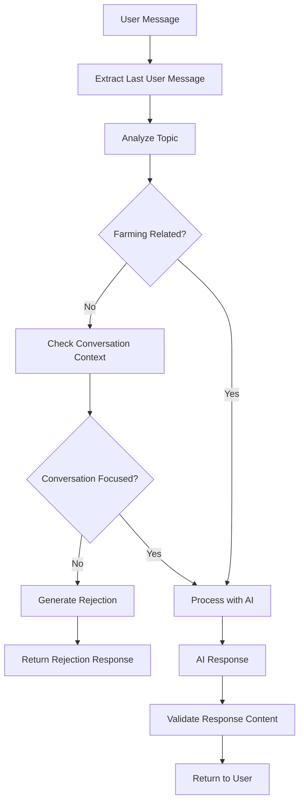

# 🛡️ AI Guardrails Implementation Guide

## Overview

This guide documents the implementation of AI guardrails to ensure the Arya Natural Farms AI chat assistant only responds to farming-related questions and rejects off-topic queries.

## 🎯 Problem Solved

**Before**: AI was answering any question (technology, entertainment, politics, etc.)
**After**: AI only responds to farming, agriculture, and marketplace-related questions

## 🏗️ Implementation Components

### 1. Guardrails Utility (`src/utils/aiGuardrails.js`)

Core utility that provides topic validation and content filtering:

#### Key Functions:

- **`isFarmingRelated(message)`**: Basic keyword-based validation
- **`analyzeMessageTopic(message)`**: Advanced topic analysis with confidence scoring
- **`isConversationFarmingFocused(messages)`**: Context-aware conversation validation
- **`generateRejectionMessage(userMessage)`**: Polite rejection responses
- **`validateResponse(response)`**: Response content validation

#### Keyword Categories:

```javascript
// ✅ ALLOWED TOPICS
- Vegetables & Crops (tomato, potato, onion, etc.)
- Farming Terms (agriculture, cultivation, harvest, etc.)
- Farming Practices (organic, irrigation, fertilizer, etc.)
- Seasons & Weather (monsoon, kharif, rabi, etc.)
- Plant Health & Pests (disease, treatment, neem, etc.)
- Marketplace Terms (buy, sell, order, payment, UPI, etc.)
- Indian Context (states, currency, measurements, etc.)

// ❌ REJECTED TOPICS
- Technology (programming, software, AI, etc.)
- Entertainment (movies, music, games, etc.)
- Politics & News (elections, government, etc.)
- Personal & General (relationships, health, etc.)
- Education (non-farming courses, exams, etc.)
- Travel & Lifestyle (hotels, restaurants, etc.)
```

### 2. API Route Updates

#### Smart Chat (`src/app/api/ai/smart-chat/route.js`)

```javascript
// Added guardrails import
import {
  isFarmingRelated,
  isConversationFarmingFocused,
  generateRejectionMessage,
  analyzeMessageTopic,
  validateResponse,
} from "@/utils/aiGuardrails";

// Added topic validation before AI processing
const topicAnalysis = analyzeMessageTopic(lastUserMessage.content);
if (!topicAnalysis.isFarmingRelated) {
  const conversationFocused = isConversationFarmingFocused(validMessages);
  if (!conversationFocused) {
    return rejectionResponse;
  }
}
```

#### Free Chat (`src/app/api/ai/free-chat/route.js`)

Similar implementation with lightweight guardrails for the free tier.

### 3. Enhanced System Prompts

Updated both API routes with strict topic restrictions:

```
🚨 STRICT TOPIC RESTRICTIONS:
- ONLY answer questions about: farming, agriculture, vegetables, crops, gardening, plant care, soil, irrigation, fertilizers, pesticides, organic farming, seasonal advice, marketplace orders, payments (UPI), and delivery
- NEVER answer questions about: technology, entertainment, politics, personal advice, health/medical, education, travel, cooking recipes, or any non-farming topics
- If asked about non-farming topics, politely redirect to farming questions
```

## 🧪 Testing Framework

### Test Script (`src/utils/testGuardrails.js`)

Comprehensive test suite with:

- **40+ farming questions** (should pass)
- **20+ non-farming questions** (should be rejected)
- **10+ edge cases** (borderline topics)
- **Conversation context testing**
- **Rejection message validation**

### Running Tests

```bash
# In Node.js environment
node src/utils/testGuardrails.js

# Or import in other files
import { runTests } from './src/utils/testGuardrails.js';
runTests();
```

## 🔧 Configuration

### Topic Analysis Scoring

```javascript
// Scoring system
farmingScore += keyword.length > 5 ? 2 : 1; // Longer keywords = higher weight
rejectionScore += topic.length > 5 ? 3 : 2; // Higher penalty for specific topics

// Pattern matching bonus
const farmingPatterns = [
  /how to (grow|plant|cultivate|harvest)/i,
  /when to (plant|sow|harvest)/i,
  /what (fertilizer|pesticide|treatment)/i,
  // ... more patterns
];
```

### Confidence Calculation

```javascript
const confidence = Math.max(
  0,
  Math.min(100, (farmingScore - rejectionScore) * 10)
);
const isFarming =
  farmingScore > rejectionScore && (farmingScore > 0 || hasPatternMatch);
```

## 📊 Guardrails Flow



## 🎯 Rejection Examples

The system generates polite, helpful rejection messages:

```
🌱 I'm specialized in helping with farming, vegetables, and agricultural questions. Could you ask me something related to farming, crops, or our marketplace?

🥬 I'm here to assist with farming advice, vegetable growing, and marketplace queries. Please ask me about agriculture, crops, or buying/selling produce!

🚜 My expertise is in farming and agriculture. I'd be happy to help with questions about vegetables, farming techniques, orders, or payments. What would you like to know about farming?
```

## ✅ Validation Scenarios

### ✅ PASS Examples:

- "How to grow tomatoes in winter?"
- "What fertilizer is best for vegetables?"
- "I want to buy fresh onions"
- "Track my order #123"
- "How to pay using UPI?"

### ❌ REJECT Examples:

- "What's the weather today?"
- "How to cook pasta?"
- "Latest movies in theaters?"
- "How to learn programming?"
- "What's the capital of France?"

### ⚠️ Edge Cases:

- "How to cook vegetables?" → REJECTED (cooking focus)
- "Health benefits of tomatoes?" → REJECTED (health focus)
- "How to start vegetable business?" → PASSED (farming business)
- "What equipment for farming?" → PASSED (farming equipment)

## 🔍 Monitoring & Logging

The system logs topic analysis for monitoring:

```javascript
console.log("🔍 Topic Analysis:", {
  isFarmingRelated: true / false,
  confidence: 75,
  farmingScore: 8,
  rejectionScore: 2,
  hasPatternMatch: true,
});
```

## 🚀 Deployment Checklist

- [x] Guardrails utility implemented
- [x] Smart chat API updated
- [x] Free chat API updated
- [x] System prompts enhanced
- [x] Test framework created
- [x] Documentation completed
- [ ] Production testing
- [ ] Monitor rejection rates
- [ ] Fine-tune keywords if needed

## 🔧 Maintenance

### Adding New Keywords

Update `FARMING_KEYWORDS` array in `aiGuardrails.js`:

```javascript
const FARMING_KEYWORDS = [
  // Add new farming-related terms
  "hydroponics",
  "aquaponics",
  "vertical farming",
  // ...
];
```

### Adding Rejection Topics

Update `REJECTED_TOPICS` array:

```javascript
const REJECTED_TOPICS = [
  // Add new topics to reject
  "cryptocurrency",
  "blockchain",
  "nft",
  // ...
];
```

### Adjusting Sensitivity

Modify scoring weights in `analyzeMessageTopic()`:

```javascript
// More strict (higher rejection threshold)
farmingScore += keyword.length > 5 ? 1 : 0.5;

// More lenient (lower rejection threshold)
farmingScore += keyword.length > 5 ? 3 : 2;
```

## 📈 Success Metrics

- **Topic Accuracy**: >95% correct classification
- **False Positives**: <5% farming questions rejected
- **False Negatives**: <5% non-farming questions passed
- **User Experience**: Polite, helpful rejection messages

## 🔗 Related Files

- `src/utils/aiGuardrails.js` - Core guardrails logic
- `src/app/api/ai/smart-chat/route.js` - Smart chat with guardrails
- `src/app/api/ai/free-chat/route.js` - Free chat with guardrails
- `src/utils/testGuardrails.js` - Test framework
- `AI_GUARDRAILS_IMPLEMENTATION_GUIDE.md` - This documentation

## 🎉 Result

The AI chat now:

- ✅ Only answers farming-related questions
- ✅ Politely rejects off-topic queries
- ✅ Maintains helpful, friendly tone
- ✅ Provides clear guidance on acceptable topics
- ✅ Supports both smart and free chat modes
- ✅ Includes comprehensive testing framework

Your AI assistant is now properly focused on farming and agriculture topics! 🌱
